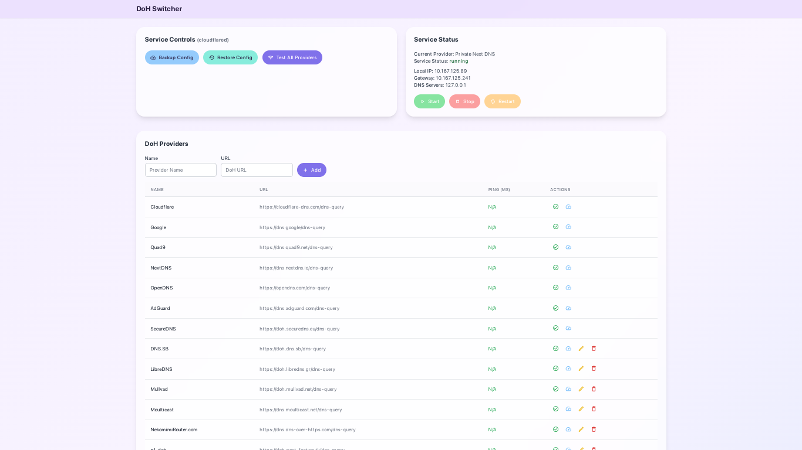

# DoH Switcher

A modern, web-based interface to manage and switch between DNS over HTTPS (DoH) providers for your system. DoH Switcher allows you to easily select, test, and manage your DNS over HTTPS providers through an intuitive interface.



## Overview

DoH Switcher is a Flask-based web application that helps you manage the DNS over HTTPS service running on your system. It works with Cloudflared as the DoH proxy service and allows you to:

- Switch between different DoH providers with a single click
- Test and compare latency between providers
- Add custom DoH providers
- Backup and restore your configuration
- Monitor service status

## Prerequisites

Before using DoH Switcher, you need to have Cloudflared installed and configured as a DoH service. Please follow the setup guide at:
[DoH Setup with Cloudflared](https://gist.github.com/1999AZZAR/d5b9207aaa3302dc7fa9bab1fa4fb80f#file-doh-setup-with-cloudflared-md)

The application will only work properly after completing the Cloudflared setup process. The setup guide will walk you through:

1. Installing Cloudflared
2. Setting up Cloudflared as a service
3. Configuring your system to use the local DNS service
4. Testing the configuration

## Installation

1. Clone this repository:
   ```bash
   git clone https://github.com/yourusername/doh-switcher.git
   cd doh-switcher
   ```

2. Install the required dependencies:
   ```bash
   pip install flask httpx dnslib
   ```

3. Run the application with sudo privileges (required to modify system services):
   ```bash
   sudo python app.py
   ```

4. Access the web interface at `http://localhost:5003`

## Features

### Service Controls

- **Backup Config**: Save your current DoH providers configuration
- **Restore Config**: Restore a previously saved configuration
- **Test All Providers**: Measure latency and connectivity of all providers at once

### DoH Provider Management

- **View Current Provider**: See which DoH provider is currently active
- **Service Status Monitoring**: Check if the Cloudflared service is running
- **Switch Providers**: Change your DoH provider with a single click
- **Test Individual Providers**: Check the performance of specific providers
- **Add Custom Providers**: Add your own DoH provider endpoints
- **Delete Custom Providers**: Remove custom providers you no longer need

### Performance Testing

The application performs two types of tests:

- **Ping Test**: Basic connectivity test to the provider's host

## Default Providers

The application comes with these pre-configured providers:

- Cloudflare (`https://cloudflare-dns.com/dns-query`)
- Google (`https://dns.google/dns-query`)
- Quad9 (`https://dns.quad9.net/dns-query`)
- NextDNS (`https://dns.nextdns.io`)
- AdGuard (`https://dns.adguard.com/dns-query`)

## Adding Custom Providers

To add a custom DoH provider:

1. Enter the provider name in the "Provider Name" field
2. Enter the DoH URL in the "DoH URL" field
3. Click "Add Provider"

The application will validate the DoH URL before adding it to ensure it's a valid DNS over HTTPS endpoint.

## Technical Details

### How it works

DoH Switcher manages the Cloudflared service by:

1. Modifying the systemd service file located at `/etc/systemd/system/cloudflared.service`
2. Updating the `--upstream` parameter to point to your selected DoH provider
3. Reloading the systemd daemon and restarting the service

### File Structure

- `app.py`: Main Flask application and backend logic
- `templates/index.html`: Web interface template
- `static/css/styles.css`: CSS styling for the web interface
- `doh_providers.json`: Saved DoH providers configuration
- `doh_providers_backup.json`: Backup of the configuration

### Logging

The application logs all actions to `doh_manager.log` for troubleshooting and auditing purposes.

## Troubleshooting

### Service Not Running

If the service status shows "not running":

1. Check the Cloudflared service manually: `sudo systemctl status cloudflared`
2. Check logs: `sudo journalctl -u cloudflared`
3. Ensure you've completed the [DoH Setup with Cloudflared](https://gist.github.com/1999AZZAR/d5b9207aaa3302dc7fa9bab1fa4fb80f#file-doh-setup-with-cloudflared-md)
4. Try restarting the service: `sudo systemctl restart cloudflared`

### Failed Tests

If providers show "Failed" in testing:

1. Check your internet connection
2. Verify the DoH provider is operational
3. Ensure there's no firewall blocking the connection

### Permission Issues

The application requires sudo privileges to modify system service files. Always run with:

```bash
sudo python app.py
```

## Security Considerations

- The application requires root privileges to modify systemd service files
- All provider URLs are validated before use
- The web interface is only accessible from localhost by default
- Consider setting up basic authentication if exposing to a network

## License

[MIT License](LICENSE)

## Contributing

Contributions are welcome! Please feel free to submit a Pull Request.

## Acknowledgments

- This project relies on Cloudflared by Cloudflare
- Thanks to all the public DoH providers for their services

---

**Note:** This application is designed to work with the Cloudflared DoH setup as described in the [setup guide](https://gist.github.com/1999AZZAR/d5b9207aaa3302dc7fa9bab1fa4fb80f#file-doh-setup-with-cloudflared-md). Make sure to complete that setup before using this application.
